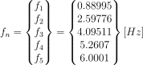
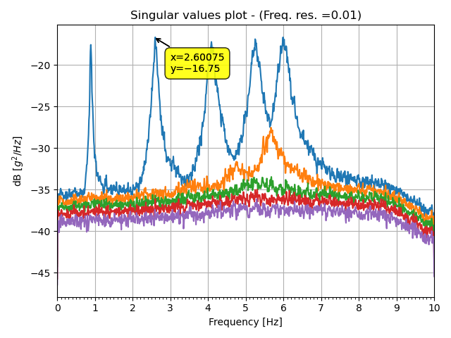
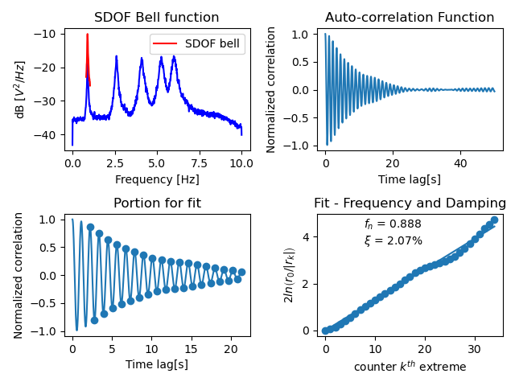
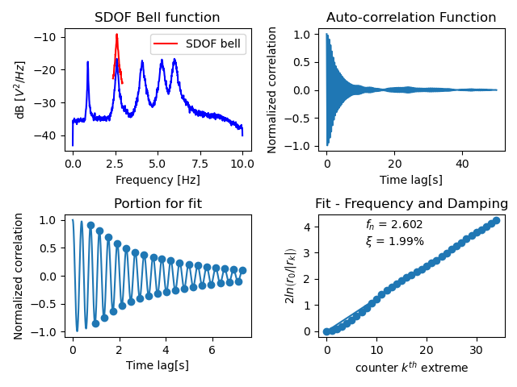
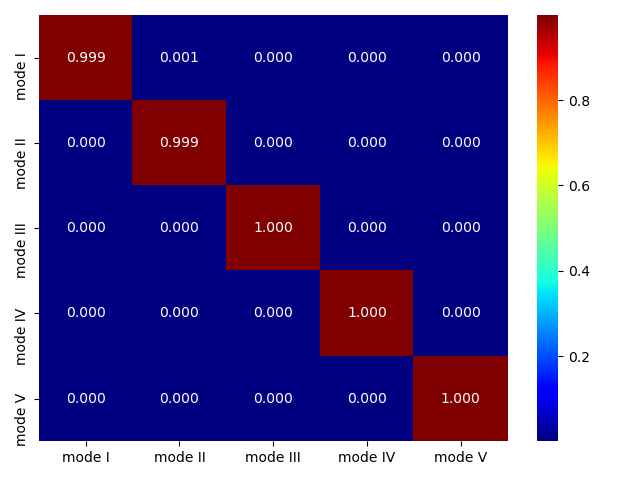

# Example

The function oma.Exdata() generates the data needed for this example. 
Let us consider a 5 Degrees of Freedom (DOF) shear type frame with lumped mass m
= 25.91 [N-s\^2/mm] at each floor, and same storey stiffness k = 10000 [N/mm] to
all stories. Solving the eigenvalue problem gives the natural frequencies of the
system:



And the (unity normalised) mode shapes:


The damping matrix is calculated assuming a constant damping of 2% to all modes 

Synthetic signals, corresponding to the acceleration time history at each floor,
are generated by the function using scipy's signal.StateSpace class. All the 5 
DOF are excited by a Gaussian white noise input, then the results from each 
channel are polluted with a noise source with SN=10%.

# Preliminary operations

First of all, we need to import all the necessary modules, and the data as an
array. In this example we will call oma.Exdata() to get the data.

When you are importing your own data you can take advantage of pandas 
pd.read\_csv. Remember to remove the time column(s), and be careful with the 
parameters “header” and “sep”, to correctly read and import the data file. 

```python

# Import modules

import numpy as np
import pandas as pd
import seaborn as sns
from scipy import signal
import matplotlib.pyplot as plt
import PyOMA as oma

# ======== PRE-PROCESSING =====================================================
# To open a .txt file create a variable containing the path to the file
_file = r"C:<Path to the txt file>\Ex_file.txt" # Path to the txt file

# open the file with pandas and create a dataframe
# N.B. whatchout for header, separator and remove time column if present
data = pd.read_csv(_file, header=0, sep="\t", index_col=False) 
data = data.to_numpy()

# to retrieve the example data 
data, (fex, FI_ex, xi_ex) = oma.Exdata()

```

We need then to provide the sampling frequency. We can also detrend and/or
decimate and/or filter the signal using standard scypy.signal functions:

```python

# Sampling frequency
fs = 100 # [Hz] Sampling Frequency

# Using SciPy's signal module we can pre-process our data e.g. performing
# decimation, trend removal and filtering. 
# Detrend and decimate
data = signal.detrend(data, axis=0) # Trend rmoval
q = 5 # Decimation factor
data = signal.decimate(data,  q, ftype='fir', axis=0) # Decimation
fs = fs/q # [Hz] Decimated sampling frequency

# Filter
_b, _a = signal.butter(12, (0.3,6.5), fs=fs, btype='bandpass')
filtdata = signal.filtfilt(_b, _a, data,axis=0) # filtered data

```

We are now ready to execute the identifications algorithms.

# Identification – Frequency Domain

We start by running oma.FDDsvp to perform the Frequency Domain Decomposition
(FDD) algorithm, which returns a plot of the Singular Values (SV) of the Power
Spectral Density (PSD) matrix, and a dictionary that contains the results that
will be processed later to extract the modal properties.

```python
# Run FDD

FDD = oma.FDDsvp(data,  fs)
```



The peaks in the plot are an estimate to the natural frequencies of the system.
To help the identification of the peaks we can take advantage of mplcursor
module.

```python

# Define list/array with the peaks identified from the plot

FreQ = [0.89, 2.6, 4.1, 5.27, 6] # identified peaks

```

We can now run oma.FDDmodEX and/or oma.EFDDmodEX to extract the modal
information according to the “FDD method” and/or the “Enhanced-FDD (EFDD)
method” respectively. All “modEX” functions return a dictionary that contains
the results of the identification in terms of modal properties. The oma.FDDmodEX
function will only extract the natural frequency and the mode shape, according
to the original FDD algorithm as presented in [@brincker2001modal]. The
oma.EFDDmodEX() function has two methods that can be selected. Method ‘EFDD’ extracts
the modal properties (frequencies, mode shapes, damping) according to the EFDD
algorithm as presented in [@brincker2001damping]. The method ‘FSDD’ instead 
extract the modal properties (frequencies, mode shapes, damping) according to 
the Frequency-Spatial Domain Decomposition (FSDD) method [@zhang2010frequency]. 
The latter methodisolates the modal coordinates by modal filtering and provides 
enhanced output PSD estimates, which in return yield better autocorrelation 
functions. The required parameters by the functions are: “FreQ” = the list of 
peaks previously identified in the SV plot; “Results” = the dictionary of 
results returned by oma.FDDsvp.


```python

# Extract the modal properties 
Res_FDD = oma.FDDmodEX(FreQ, FDD[1]) # extracting modal properties using standard FDD
Res_EFDD = oma.EFDDmodEX(FreQ, FDD[1], method='EFDD') # " " " " Enhanced-FDD
Res_FSDD = oma.EFDDmodEX(FreQ, FDD[1], method='FSDD', npmax = 35, MAClim=0.95, plot=True) # " " " " FSDD with additional input parameters

```




We can now see the results of the identification by inspecting the results
dictionaries:

```python

Res_FDD[‘Frequencies’] = [0.89, 2.6, 4.09, 5.25, 5.99]

Res_EFDD[‘Frequencies’] = [0.888922, 2.60223, 4.08213, 5.25452, 6.00018]

Res_FSDD[‘Frequencies’] = [0.888299, 2.60237, 4.09628, 5.23675, 6.02448]

Res_EFDD[‘Damping’] = [0.0226723, 0.0211802, 0.0221737, 0.0186768, 0.0162947]

Res_FSDD[‘Damping’] = [0.0207433, 0.0199027, 0.0214159, 0.0196272, 0.0187716]

Res_FDD[‘Mode Shapes’] =

| 0.25134  | 0.769842  | 1         | 0.885276  | 0.561732  |
|----------|-----------|-----------|-----------|-----------|
| 0.53948  | 1         | 0.270606  | -0.781869 | -0.936679 |
| 0.748727 | 0.567836  | -0.892552 | -0.262885 | 1         |
| 0.920345 | -0.27664  | -0.533285 | 1         | -0.785869 |
| 1        | -0.920871 | 0.73329   | -0.543235 | 0.253549  |

Res_EFDD[‘Mode Shapes’] =

| 0.267461 | 0.761337  | 1         | 0.91893   | 0.528522  |
|----------|-----------|-----------|-----------|-----------|
| 0.540725 | 1         | 0.283499  | -0.762619 | -0.89945  |
| 0.73491  | 0.544052  | -0.89023  | -0.286976 | 1         |
| 0.931503 | -0.283387 | -0.545335 | 1         | -0.769609 |
| 1        | -0.874993 | 0.741409  | -0.551697 | 0.278106  |


Res_FSDD[‘Mode Shapes’] =

| 0.271745 | 0.759193  | 1         | 0.920024  | 0.531951  |
|----------|-----------|-----------|-----------|-----------|
| 0.542999 | 1         | 0.282955  | -0.767985 | -0.904347 |
| 0.741326 | 0.542259  | -0.900547 | -0.284978 | 1         |
| 0.932505 | -0.280532 | -0.544536 | 1         | -0.77068  |
| 1        | -0.881809 | 0.745016  | -0.552481 | 0.277287  |


```

# Identification – Time Domain

When it comes to Time domain methods, PyOMA allows to perform both SSI-dat
[@van2012subspace] and SSI-cov [@peeters1999reference] algorithms. To 
analyse the data with these time domain parametric procedures one can run 
the following functions:

```python
# Run SSI
br = 15
SSIcov= oma.SSIcovStaDiag(data, fs, br) # running SSI-cov
SSIdat = oma.SSIdatStaDiag(data, fs, br, ordmax=60, lim=(0.01, 0.05, 0.02, 0.1)) # running SSI-dat with additional input parameters
```

For these functions the required parameters are the dataset, the sampling 
frequency and the number of block rows (time lags). The optional parameters 
allow to define the maximum model order, and the limit values to be used 
for the stability criteria of the poles in the stabilisation diagram.
Here as well we can take advantage of mplcursor module to identify the
stable frequencies lines.


Once the identified frequencies have been collected, it is possible to
extract the estimates of the modal properties. To do so just run the function
SSIModEX(), passing to it the array/list of frequencies identified in the 
stabilisation diagram and the dictionary of results returned by either
oma.SSIcovStaDiag() or oma.SSIdatStaDiag().

```python
# Extract the modal properties
Res_SSIcov = oma.SSIModEX(FreQ, SSIcov[1]) # extracting modal properties
Res_SSIdat= oma.SSIModEX(FreQ, SSIdat[1]) # extracting modal properties
```


We can now see the results of the identification by inspecting the results
dictionaries:

```python

Res_SSIcov[‘Frequencies’] = [0.888782, 2.5977, 4.09384, 5.25337, 6.00183]

Res_SSIdat[‘Frequencies’] = [0.888743, 2.59783, 4.0945, 5.25339, 6.00224]

Res_SSIcov[‘Damping’] = [0.0205092, 0.0198478, 0.0211763, 0.0207207, 0.0190943]

Res_SSIdat[‘Damping’] = [0.0216251, 0.0198527, 0.0229909, 0.0208779, 0.0200183]


Res_SSIcov[‘Mode Shapes’] =

| 0.265703 | 0.780006  | 1         | 0.911646  | 0.547661  |
|----------|-----------|-----------|-----------|-----------|
| 0.538122 | 1         | 0.275115  | -0.76086  | -0.923849 |
| 0.741008 | 0.56412   | -0.899589 | -0.280149 | 1         |
| 0.928411 | -0.288147 | -0.536196 | 1         | -0.774282 |
| 1        | -0.944359 | 0.742725  | -0.545645 | 0.275831  |


Res_SSIdat[‘Mode Shapes’] =

| 0.279095 | 0.772773  | 1         | 0.925599  | 0.542878  |
|----------|-----------|-----------|-----------|-----------|
| 0.53965  | 1         | 0.285698  | -0.768124 | -0.916186 |
| 0.742472 | 0.551479  | -0.914432 | -0.286194 | 1         |
| 0.937415 | -0.282122 | -0.550359 | 1         | -0.770326 |
| 1        | -0.924122 | 0.754373  | -0.555319 | 0.275067  |

```


# Post-processing

Now let's do some plotting!

```python

# =============================================================================
# Make some plots
# =============================================================================
MS_FDD = Res_FDD['Mode Shapes'].real
MS_EFDD = Res_EFDD['Mode Shapes'].real
MS_FSDD = Res_FSDD['Mode Shapes'].real
MS_SSIcov = Res_SSIcov['Mode Shapes'].real
MS_SSIdat = Res_SSIdat['Mode Shapes'].real
_nch = data.shape[1]

MAC = np.reshape(
        [oma.MaC(FI_ex[:,l], MS_FSDD[:,k]).real for k in range(_nch) for l in range(_nch)], # (_nch*_nch) list of MAC values 
        (_nch, _nch)) # new (real) shape (_nch x _nch) of the MAC matrix

crossMAC = np.reshape(
        [oma.MaC(MS_SSIcov[:,l], MS_SSIdat[:,k]).real for k in range(_nch) for l in range(_nch)], # (_nch*_nch) list of MAC values 
        (_nch,_nch)) # new (real) shape (_nch x _nch) of the MAC matrix

col = ["mode I", "mode II", "mode III", "mode IV", "mode V"]

MAC = pd.DataFrame(MAC, columns=col, index=col)
crossMAC = pd.DataFrame(crossMAC, columns=col, index=col)

fig, ax = plt.subplots()
sns.heatmap(MAC,cmap="jet",ax=ax,annot=True, fmt='.3f',)
fig.tight_layout()
plt.show()

fig, ax1 = plt.subplots()
sns.heatmap(crossMAC,cmap="jet", ax=ax1, annot=True, fmt='.3f',)
fig.tight_layout()
plt.show()
```





# Dcumentation

See the [documentation page](https://github.com/dagghe/PyOMA/wiki/Function-Description). 
for further details on the functions.
