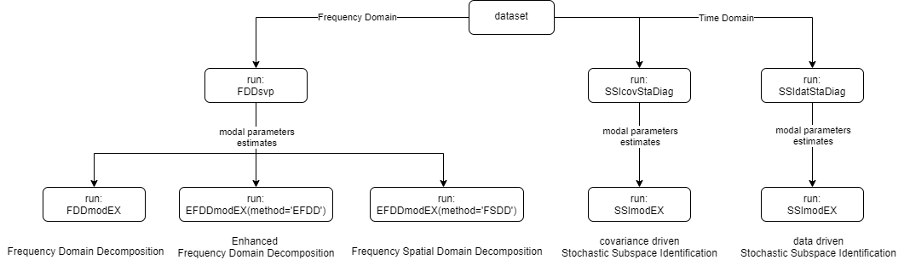

# PyOMA
This software was created to perform output-only modal identification (Operational Modal Analysis, OMA).

OMA allows the experimental estimation of the modal parameters (natural frequencies, mode shapes, damping ratios) of a structure from measurements of the vibration response in operational condition.

## What is PyOMA?
PyOMA is a python module that allows to perform OMA on ambient vibration measurments datasets.

PyOMA include the following algorithms:

1. Frequency Domain Decomposition (FDD)

	1a. Original Frequency Domain Decomposition (FDD)
	
	2a. Enhanced Frequency Domain Decomposition (EFDD)
	
	3a. Frequency Spatial Domain Decomposition (FSDD)
	
2. Stochastic Subspace Identification (SSI)

	2a. Covariance-driven Stochastic Subspace Identification (cov-SSI)
	
	2b. Data-driven Stochastic Subspace Identification (dat-SSI)	
	

To better untersdand the workflow of the functions, see the workflow [here](https://github.com/dagghe/PyOMA#workflow).

## Installing PyOMA
As a prerequisite to install PyOMA, you need to install [Anaconda](https://docs.anaconda.com/anaconda/install/) first.
You should install a Python version greather equal 3.5 or the software may run in troubles.

To install PyOMA, you need to run the following commands:

 - pip install pyOMA
 - conda install -c conda-forge pyOMA
 
 ### Dependencies
 - numpy (https://numpy.org/)
 - pandas (https://pandas.pydata.org/)
 - scipy -> signal (https://www.scipy.org/)
 - scipy.optimize -> curve_fit (https://www.scipy.org/)
 - matplotlib.pyplot (https://matplotlib.org/)
 - matplotlib.ticker -> [MultipleLocator,FormatStrFormatter] (https://matplotlib.org/)
 - seaborn (https://seaborn.pydata.org/)
 - mplcursors (https://mplcursors.readthedocs.io/en/stable/)

# Workflow

FDD:

	1. run FDDsvp

		2.a run FDDmodEX to run original FDD
			
			and/or
			
		2.b run EFDDmodEX(method='EFDD') to run EFDD
			
			and/or
			
		2.c run EFDDmodEX(method='FSDD') to run FSDD

SSI

	1.a run SSIcovStaDiag 
		
		2. run SSImodEX to run cov-SSI

			and/or

	1.b run SSIdatStaDiag 
		
		2. run SSImodEX to run dat-SSI 

# Function Description

A complete description of the functions available in PyOMA can be found in the page [Function Description](https://github.com/dagghe/PyOMA/wiki/Function-Description).
